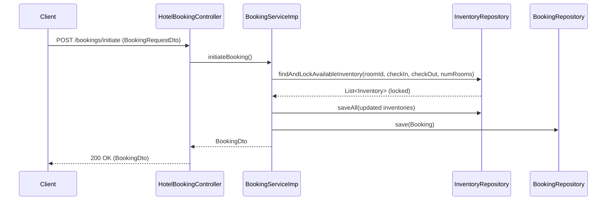

# LunaCordis — Project Documentation

## Overview
LunaCordis is a Spring Boot (Java 21) hotel management backend providing hotel CRUD, browsing/search, room inventory management, and booking flows. The codebase follows a layered architecture: Controllers (HTTP), Services (business logic), Repositories (JPA data access), DTOs and Entities.

## Key Technologies
- Java 21
- Spring Boot 4.x
- Spring Data JPA
- PostgreSQL (runtime dependency)
- ModelMapper, Lombok

## Project Structure (high level)
- src/main/java/org/cloudspiretech/in/LunaCordis
  - controller: REST controllers exposing HTTP endpoints
  - service: business logic implementations
  - repository: Spring Data JPA interfaces
  - entity: JPA entity models (Hotel, Room, Inventory, Booking, User, Guest, Payment)
  - dto: transport objects for requests/responses
  - advice: global exception/response handlers
  - config: MapperConfig (ModelMapper)

## Build & Run
1. Ensure Java 21 and Maven installed.
2. Configure PostgreSQL connection in src/main/resources/application.yaml or application.properties.
3. Build and run:
   - mvn clean package
   - java -jar target/LunaCordis-0.0.1-SNAPSHOT.jar

## Important Configuration
- application.yaml sets spring.application.name; add datasource settings for PostgreSQL:

Example (application.yaml):

spring:
  datasource:
    url: jdbc:postgresql://localhost:5432/lunacordis
    username: your_user
    password: your_password
  jpa:
    hibernate:
      ddl-auto: update


## REST API Endpoints (from controllers)

- Hotel admin (src...controller.HotelController)
  - POST /admin/hotels/create — create hotel (HotelDto)
  - GET /admin/hotels/{id} — get hotel by id
  - GET /admin/hotels — list hotels
  - PUT /admin/hotels/{hotelId} — update hotel
  - DELETE /admin/hotels/{hotelId} — delete hotel
  - PATCH /admin/hotels/{id} — activate hotel (initialize inventory)

- Hotel browsing (src...controller.HotelBrowseController)
  - GET /hotels/search — search hotels (HotelSearchRequestDto) returns paged HotelDto
  - GET /hotels/{hotelId}/info — get HotelInfoDto (hotel + rooms)

- Booking (src...controller.HotelBookingController)
  - POST /bookings/initiate — initiate a booking (BookingRequestDto) => BookingDto
  - POST /bookings/{bookingId}/addGuest — add guests to a booking (List<GuestDto>) => BookingDto

- Other controllers: RoomController, UserController exist for room and user management (see code for exact routes).

## Core Flows

1) Booking initiation (high-level steps)
- Client POST /bookings/initiate with BookingRequestDto (hotelId, roomId, dates, numberOfRooms)
- BookingService (BookingServiceImp) locks available Inventory rows for the requested room and date range
- If inventory is available for all days, reservedCount updated and persisted
- Booking entity created (status RESERVED) and saved
- BookingDto returned

2) Add guests
- POST /bookings/{id}/addGuest with guest data
- Service validates booking state and expiration, maps GuestDto to Guest entities, associates with Booking, updates status to GUEST_ADDED and persists

## Data Model (entities summary)
- Hotel: id, name, address, active flag, contact info, rooms (one-to-many)
- Room: id, type, capacity, price, hotel
- Inventory: date-level availability per room (availableCount, reservedCount)
- Booking: id, hotel, room, checkInDate, checkOutDate, roomCount, bookingStatus (RESERVED, GUEST_ADDED, ...), guests
- Guest: linked to Booking and User
- User: application user
- Payment: payment details and status

## Error Handling
- GlobalExceptionHandler and GlobalResponseHandler provide consistent API error responses and wrapping (see src/main/java/.../advice).
- ResourceNotFoundException used when entities are missing.

## Diagrams

Below are Mermaid diagrams included for convenience. Use a Markdown renderer that supports Mermaid (e.g., GitHub, VS Code with Mermaid preview) or convert to images using mermaid CLI.

### Architecture (component) diagram

```mermaid
flowchart TB
  subgraph HTTP
    Client[Client]
  end
  subgraph API
    Controllers[Controllers]\n(Hotel, Booking, Room, User)
  end
  subgraph ServiceLayer
    Services[Services]\n(HotelService, BookingService, InventoryService)
  end
  subgraph Persistence
    Repos[Repositories]\n(JPA Repos: HotelRepo, RoomRepo, InventoryRepo, BookingRepo)
    DB[(PostgreSQL DB)]
  end

  Client -->|HTTP JSON| Controllers --> Services --> Repos --> DB
```

### Booking sequence (simplified)



## Notes & Future Improvements
- Dynamic pricing, payments integration, authentication/authorization (roles), and more robust validation are TODOs.
- Add integration and unit tests for booking concurrency to ensure inventory locking is safe under load.

---
Generated documentation for quick onboarding. For a rendered diagram image or deeper entity UML, specify which diagrams or file format (PNG/SVG/Mermaid) is preferred.